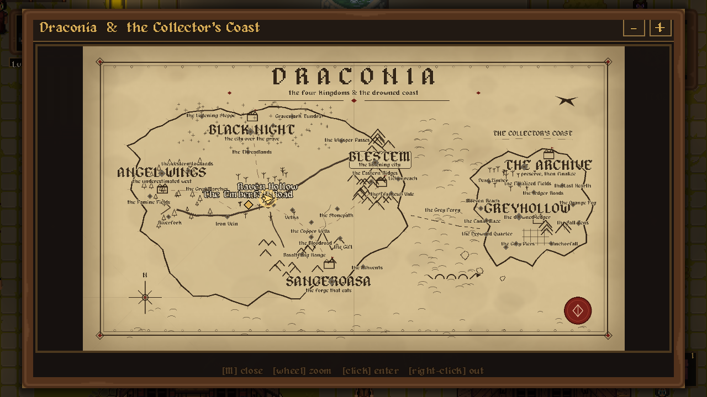
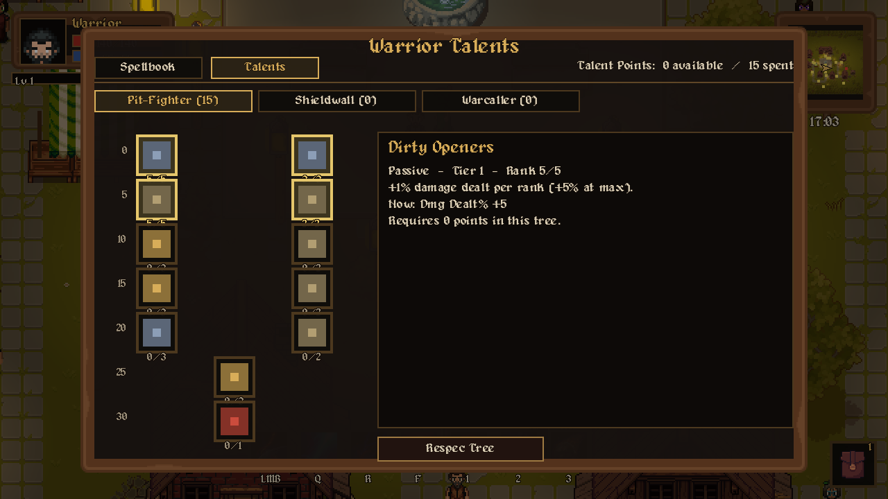
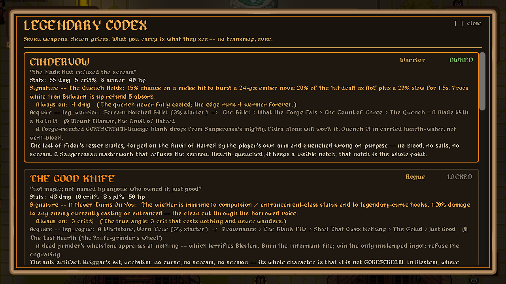
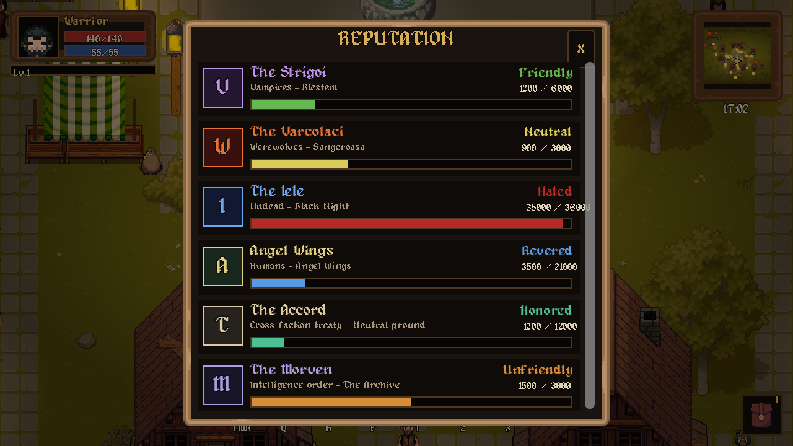
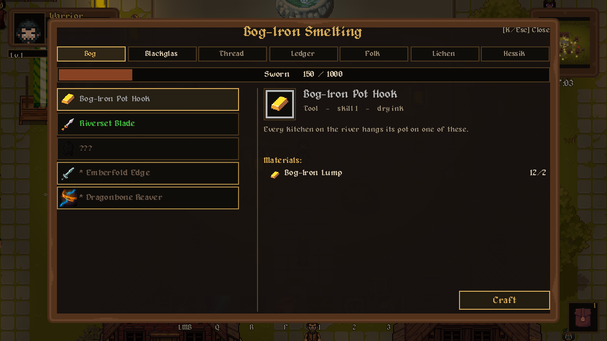
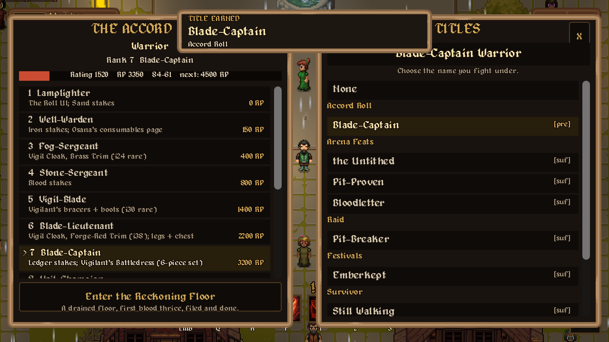
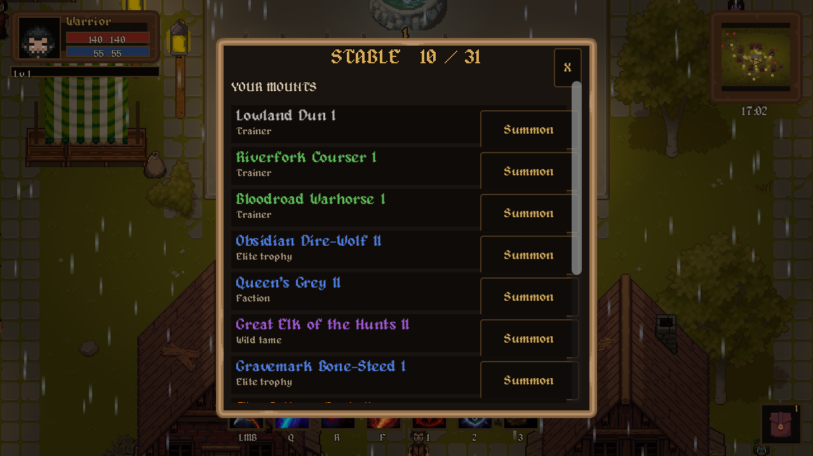

# Raven Hollow

**A dark medieval pixel RPG set in the world of Draconia.**
Graveyard-Keeper-styled: muted palettes, warm lanterns, painterly pixel detail — grim, weighty, lived-in.

## The game

A fog-drowned border town at the edge of a centuries-long cold war — and something beneath the graveyard is patiently rewriting the world back to the way it was before people.

- **Six playable classes** — Warrior, Rogue, Mage, Paladin, Necromancer, Hunter — full ability kits, mouse-aimed combat, real VFX
- **Loot & legendaries** — WoW-style backpack + paper-doll equipment, rarity tiers, legendary relics with living effects
- **A handcrafted town** — districts, 19+ villagers with their own words, golden-dusk lighting
- **The wilderness** — wolves, boars, bears, and worse, past the town gate
- **An original universe** — Draconia: four factions, a buried world-machine, a language that should never be read aloud

## A whole RPG under the hood

Not a vertical slice with the depth painted on — the real machinery of a classic MMO-scale RPG is here and playable. Press **`` ` ``** (backtick) in game to open the menu and reach all of it.

### The world of Draconia

A hand-lettered atlas of four kingdoms and the drowned Collector's Coast — WoW-style zoom from the whole continent down to your own footsteps.

### Character depth

| Talent trees | Legendary codex |
|---|---|
|  |  |
| Three trees per class, 31-point classic builds | Seven legendaries, each a questline and a living effect — no transmog, ever |

### Systems

| Faction reputation | Crafting professions |
|---|---|
|  |  |
| Six factions, Hated → Exalted | Seven professions, skill to 1000, craftable legendaries |

| PvP — the Accord Roll | The mount stable |
|---|---|
|  |  |
| 14-rank ladder, 1v1 arena, earned titles | 31 mounts — trainer stock, elite trophies, wild tames |

Also in: a deed-book of achievements, an auction house & bank, a living calendar of seasonal events, a bestiary codex, socketed runewords, mounts, waystation travel, and the Grey Ferry between continents.

## Controls

| Key | Opens | Key | Opens |
|---|---|---|---|
| **`** | **Menu (all systems)** | `M` | Map |
| `I` | Inventory / bags | `C` | Character sheet |
| `P` | Spellbook & talents | `L` | Quest log |
| `O` | Reputation | `Y` | Achievements |
| `T` | Titles | `Shift+H` | Mount stable |
| `U` | Socketing / runewords | `]` | Legendary codex |
| `B` | Bestiary / shop | `N` | Calendar |
| `V` | Auction house | `X` | Bank |
| `F10` | Options / settings | `Esc` | Pause |

Movement WASD/arrows · `J` attack / left-click aim · `1`–`4`, `Q`/`R`/`F` abilities · `E` interact.

## Tech

Built with **Godot 4.6**. Scenes constructed in GDScript; pixel-perfect 640×360 viewport, integer-scaled.

Run: open the project in Godot 4.6+ and press **F5**.

## Credits

All third-party art/audio and licenses are recorded in [CREDITS.md](CREDITS.md) — Szadi Art, Cainos, Anokolisa, the LPC artists, Pimen, Kenney, J.W. Bjerk, Hewett Tsoi, pixel-boy, and more. The LPC decoration art is CC-BY-SA; its credits file ships with the game.

**Project site:** [kriggar.github.io/raven-hollow-site](https://kriggar.github.io/raven-hollow-site/)
