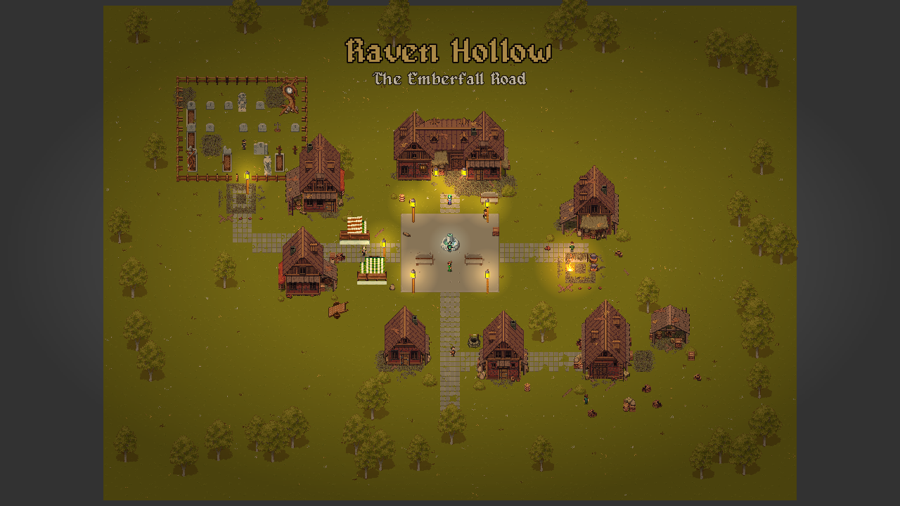
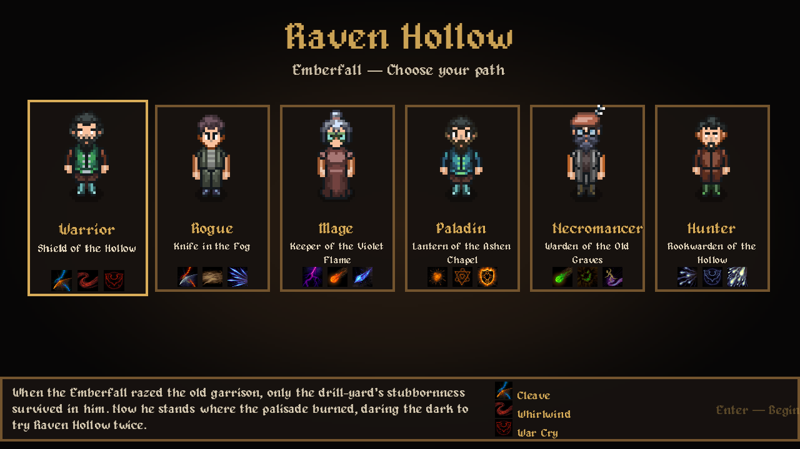
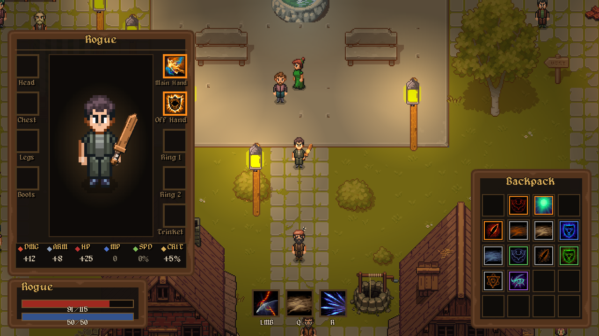

# Raven Hollow

**A dark medieval pixel RPG set in the world of Draconia.**
Graveyard-Keeper-styled: muted palettes, warm lanterns, painterly pixel detail — grim, weighty, lived-in.

## The game

A fog-drowned border town at the edge of a centuries-long cold war — and something beneath the graveyard is patiently rewriting the world back to the way it was before people.

- **Six playable classes** — Warrior, Rogue, Mage, Paladin, Necromancer, Hunter — full ability kits, mouse-aimed combat, real VFX
- **Loot & legendaries** — WoW-style backpack + paper-doll equipment, rarity tiers, legendary relics with living effects
- **A handcrafted town** — districts, 19+ villagers with their own words, golden-dusk lighting
- **The wilderness** — wolves, boars, bears, and worse, past the town gate
- **An original universe** — Draconia: four factions, a buried world-machine, a language that should never be read aloud

## Tech

Built with **Godot 4.6**. Scenes constructed in GDScript; pixel-perfect 640×360 viewport, integer-scaled.

Run: open the project in Godot 4.6+ and press F5.

## Credits

All third-party art/audio and licenses are recorded in [CREDITS.md](CREDITS.md) — Szadi Art, Cainos, Anokolisa, the LPC artists, Pimen, Kenney, J.W. Bjerk, Hewett Tsoi, pixel-boy, and more. The LPC decoration art is CC-BY-SA; its credits file ships with the game.

**Project site:** see `docs/` (GitHub Pages).
